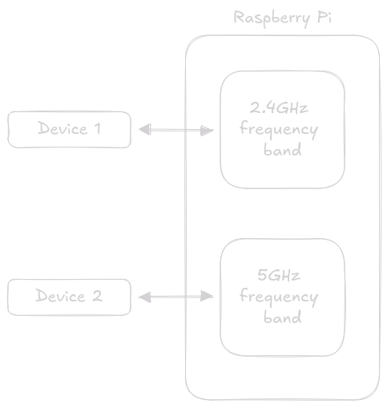

# Raspberry Pi

The following is a step-by-step guide on how to setup a brand-new Raspberry Pi 4 as a dual-band
wireless hotspot with internet access through a remote VPN server. The overall setup looks something
like this:


As a result, any device connected to our Raspberry Pi gains indirect access to the Internet via the
VPN tunnel. If the connection to the VPN server is lost, the tunnel closes, preventing packets from
reaching the Internet.

## Setup Guide

This document assumes that the network device used for a 2.4GHz wireless access point is named
`ap0`, the network device used for a 5GHz wireless access point - `ap1`, and the network device
connected to the internet - `inet0`. Keep in mind that the selected hardware must support the
frequency on which it operates.

In order to set appropriate adapter names in your system, add the following to
`/etc/udev/rules.d/70-netnaming.rules`:

```
SUBSYSTEM=="net", ACTION=="add", ATTR{address}=="<ap0   mac address>", NAME="ap0"
SUBSYSTEM=="net", ACTION=="add", ATTR{address}=="<ap1   mac address>", NAME="ap1"
SUBSYSTEM=="net", ACTION=="add", ATTR{address}=="<inet0 mac address>", NAME="inet0"
```

Additionally, make sure that the access point devices are not used to connect to the internet. We
can do that by adding the following to `/etc/NetworkManager/conf.d/unmanaged.conf`:

```
[keyfile]
unmanaged-devices=interface-name:ap0,interface-name:ap1
```

After that, restart `NetworkManager` and connect to the internet using the appropriate network
device (`inet0`).

### Prerequisites

Before following the instructions below, we must ensure our system is up-to-date and has all the
expected packages required for this setup.

At first, the fresh Raspberry Pi OS may require an update:

```sh
sudo apt-get update && sudo apt-get upgrade -y
```

Then, run the following command to ensure all of the tools required for this setup are available:

```sh
sudo apt-get install vim ufw hostapd dnsmasq dhcpcd
```

### Bridge network interfaces

When new devices connect to our Raspberry Pi, they will have to choose between the 2.4GHz and 5GHz
frequency bands. These bands are managed by separate network interfaces, meaning that devices
connected on different frequencies will reside on separate internal networks and therefore unable to
communicate with each other directly:



For this reason, we need to [bridge](https://en.wikipedia.org/wiki/Network_bridge) these network
interfaces so that internet traffic can flow freely between them.

#### Establish a network bridge

Add the following to `/etc/network/interfaces`:

```
auto br0
iface br0 inet manual
    bridge_stp off
    # bridge_ports ...
```

If you have additional network devices or Ethernet connections, simply add them to the
`bridge_ports` field. Note that it is not possible to bridge wireless interfaces.

#### Assign static IP address to the network bridge

Append the lines below to the end of `/etc/dhcpcd.conf`:

```
interface br0
    static ip_address=5.9.0.1
    nohook
```

You can change `5.9.0.1` to any other address as long as it does not conflict with existing
addresses and subnets on your system.

You may need to restart `dhcpcd.service` after that.

### Setup the Wi-Fi link layer

This step is necessary in order to enable wireless clients to associate to our access point and
exchange IP packets with it.

#### IP forwarding

The first thing we need to do is enable packet forwarding (i.e. allow traffic to flow from one
network to another). This can be done by adding the following to `/etc/sysctl.d/30-ipforward.conf`:

```
net.ipv4.ip_forward = 1
# net.ipv4.conf.all.forwarding = 1
# net.ipv6.conf.all.forwarding = 1
```

#### Disable IPv6

To further simplify a few things ahead of time, we can disable IPv6 support by modifying
`/etc/sysctl.d/40-ipv6.conf`:

```
net.ipv6.conf.all.disable_ipv6 = 1
# net.ipv6.conf.nic0.disable_ipv6 = 1
# ...
# net.ipv6.conf.nicN.disable_ipv6 = 1
```

At this point, restart the `systemd-sysctl` service to apply the changes.

#### Configure DHCP (+DNS)

At this point, we need a way to assign IP addresses to new access point/Ethernet devices. For that,
we have installed `dnsmasq` earlier. It will additionally handle incoming DNS requests.

The configuration file at `/etc/dnsmasq.conf` should look something like this:

```
interface=br0
bind-dynamic

listen-address=127.0.0.1

dhcp-option=3,5.9.0.1

dhcp-range=5.9.0.10,5.9.0.100,24h
```

As always, don't forget to restart `dnsmasq.service`.

#### Setup hostapd

Lastly, we must configure `hostapd` to use our network devices as access points.

For 5GHz frequency band, add the following to `/etc/hostapd/ap0.conf`:

```
interface=ap0
bridge=br0
driver=nl80211

ssid=raspi5

ieee80211d=0
country_code=DE

channel=0
hw_mode=a

wmm_enabled=1
ieee80211n=1
ht_capab=[HT40+][SMPS-STATIC][SHORT-GI-20][SHORT-GI-40][MAX-AMSDU-3839][DSSS_CCK-40]
require_ht=1

ieee80211ac=1
vht_capab=[SHORT-GI-80][SU-BEAMFORMEE]
require_vht=1
vht_oper_chwidth=1

# Do not isolate clients
ap_isolate=0

# Accept unless in deny list
macaddr_acl=0
#accept_mac_file=/etc/hostapd/ap0.accept
#deny_mac_file=/etc/hostapd/ap0.deny

wpa=2
wpa_passphrase=fivenine
wpa_key_mgmt=WPA-PSK
wpa_pairwise=CCMP
rsn_pairwise=CCMP

auth_algs=3

# Disable WPS
wps_state=0

# hostapd event logger configuration
logger_syslog=-1
logger_syslog_level=0
logger_stdout=-1
logger_stdout_level=0
```

For 2.4GHz frequency band, add the following to `/etc/hostapd/ap1.conf`:

```
interface=ap1
bridge=br0
driver=nl80211

ssid=raspi

ieee80211d=0
country_code=DE

channel=1
hw_mode=g

wmm_enabled=0
ieee80211n=1
ht_capab=[HT40+][SHORT-GI-20][SHORT-GI-40][MAX-AMSDU-7935][DSSS_CCK-40]
require_ht=0

ieee80211ac=0
# vht_capab=[SHORT-GI-80][SU-BEAMFORMEE]
# require_vht=1
# vht_oper_chwidth=1

# Do not isolate clients
ap_isolate=0

# Accept unless in deny list
macaddr_acl=0
#accept_mac_file=/etc/hostapd/ap1.accept
#deny_mac_file=/etc/hostapd/ap1.deny

wpa=2
wpa_passphrase=fivenine
wpa_key_mgmt=WPA-PSK
wpa_pairwise=CCMP
rsn_pairwise=CCMP

auth_algs=3

# Disable WPS
wps_state=0

# hostapd event logger configuration
logger_syslog=-1
logger_syslog_level=0
logger_stdout=-1
logger_stdout_level=0
```

After that, you can start `hostapd@ap0.service` and `hostapd@ap1.service`. `raspi5` and `raspi`
should appear on the wireless network list.

Keep in mind that certain fields in the configuration above may depend on the network device in use.
See [docs](https://wireless.wiki.kernel.org/en/users/Documentation/hostapd) for more information.

### Network configuration

At this stage, the AP should function like any other router, except that it currently does not
provide internet access. But we'll address that in a bit.

#### Firewall

The AP needs a way to manage incoming and outgoing IP packets which can be accomplished with a
firewall. If you haven’t enabled it yet, you may need to do so.

```sh
sudo systemctl enable --now ufw && sudo ufw enable
```

That's it. Now, let's block any incoming or outgoing traffic.

```sh
sudo ufw default deny incoming && sudo ufw default deny outgoing
```

The AP should stop working at this point. Let's fix that by adding a few exception rules.

```sh
sudo ufw allow in from any port 68 to any port 67 proto udp comment "Allow incoming DHCP traffic"
sudo ufw allow in to any port 53 comment "Allow incoming DNS traffic"
sudo ufw allow in to any port 22 comment "Allow incoming SSH traffic"

sudo ufw allow out to 5.9.0.0/24 comment "Allow outgoing LAN traffic"
```

These should allow AP-related packets to pass through.

#### VPN

At this point, it's advisable to refer to your VPN service documentation. Typically, you just need
to download an `.ovpn` file from your VPN provider and import it into `NetworkManager`:

```sh
nmcli con import type openvpn file <ovpn-file>
```

Following this, you should add additional exception rules to `ufw` to allow `OpenVPN` to reach the
destination VPN server.

Once the connection to the server is established, `OpenVPN` will create a VPN tunnel (typically
`tun0`). To enable internet access through this tunnel, we need to add an additional rule to `ufw`:

```sh
sudo ufw allow out on tun0 to any from any
```

Now, outgoing packets will only pass through this tunnel. If the connection to the VPN server is
lost, the tunnel closes, preventing packets from reaching the Internet.

#### Internet access

In the final step, we just need to enable NAT on `tun0` and allow packets from `br0` to reach it.

To do that, add the following to `/etc/ufw/before.rules` just before the filter rules.

```
*nat
:POSTROUTING ACCEPT [0:0]
-A POSTROUTING -o tun0 -j MASQUERADE
COMMIT
```

And finally, append this line below right after the filter rules:

```
-A FORWARD -i br0 -o tun0 -j ACCEPT
```

Now, AP/Ethernet clients should have internet access through a remote VPN server.
